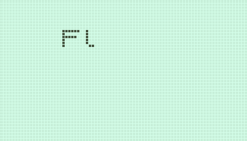
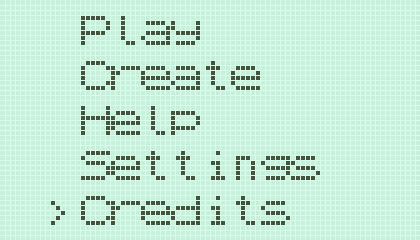

# Flip It
This game was made for the [Nokia 3310 Jam 3](https://itch.io/jam/nokiajam3).

## How to play
    8462|WASD|Arrow Keys - Move
    .                    - Enter
    /                    - Back

Move the car around the grid and reach the target cell with all lights off to win.
Moving to a cell flips that cell and it's four neighbouring cells.

**Editor Mode**

Create your own levels and share them.
Levels are created in reverse from target position to starting position.
The editor works in three stages -

 - Resize the grid using `1|7` and `3|9`. Move to the target cell and press `.` to start drawing.
 - Move around to flip cells until one before the starting position and press `.` to finish drawing.
 - A border around the screen will indicate the last move. Move one last time to finish creating the level.

A code will be displayed which can be entered in the loader from the level selection screen.

## Building
**Prerequisites**
 - raylib
 - MSVC for Windows

**Windows**

Run `build.bat` from `code/`.

**Linux**

Run `build.sh` from `code/`.

The executable will be created in `build/`, move it to `data/` and run it.

## License

This is free and unencumbered software released into the public domain.

Anyone is free to copy, modify, publish, use, compile, sell, or
distribute this software, either in source code form or as a compiled
binary, for any purpose, commercial or non-commercial, and by any
means.

In jurisdictions that recognize copyright laws, the author or authors
of this software dedicate any and all copyright interest in the
software to the public domain. We make this dedication for the benefit
of the public at large and to the detriment of our heirs and
successors. We intend this dedication to be an overt act of
relinquishment in perpetuity of all present and future rights to this
software under copyright law.

THE SOFTWARE IS PROVIDED "AS IS", WITHOUT WARRANTY OF ANY KIND,
EXPRESS OR IMPLIED, INCLUDING BUT NOT LIMITED TO THE WARRANTIES OF
MERCHANTABILITY, FITNESS FOR A PARTICULAR PURPOSE AND NONINFRINGEMENT.
IN NO EVENT SHALL THE AUTHORS BE LIABLE FOR ANY CLAIM, DAMAGES OR
OTHER LIABILITY, WHETHER IN AN ACTION OF CONTRACT, TORT OR OTHERWISE,
ARISING FROM, OUT OF OR IN CONNECTION WITH THE SOFTWARE OR THE USE OR
OTHER DEALINGS IN THE SOFTWARE.

For more information, please refer to <http://unlicense.org/>
